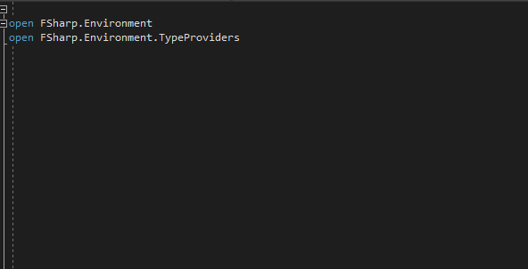

[](https://travis-ci.org/afractal/EnvironmentVariableProvider)
[](https://ci.appveyor.com/project/hermesxgjini/environmentvariableprovider)



## **Install**

Install via nuget package manager:

`PM> Install-Package EnvironmentVariableProvider`

## **Getting started**

To get started, just instantiate the type provider and pass in an environment variable flag as the parameter.

```fsharp
open FSharp.Environment.TypeProviders
open FSharp.Environment

type EnvVars = EnvironmentVariableProvider< target = EnvironmentTarget.Machine >

let envVars = EnvVars()
```

The variable **envVars**  now contains the list of env variables.


